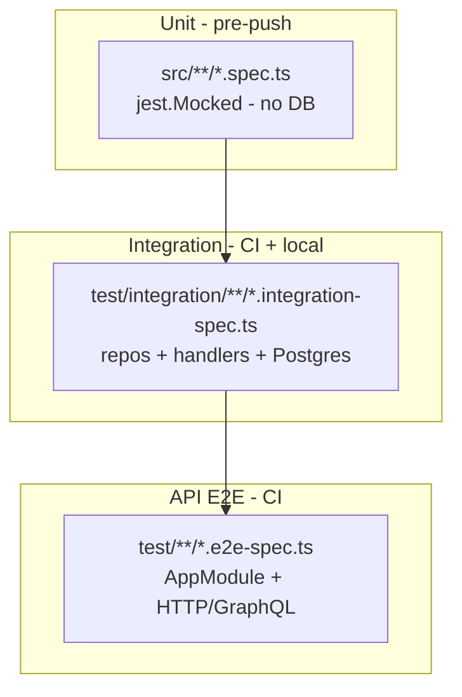

# Design: Integration test strategy for gardenia-api

## Context

gardenia-api uses a three-layer architecture (domain / application / infrastructure / transport) with bounded contexts `auth`, `users`, and `spaces`. Persistence is TypeORM + PostgreSQL with row-level tenant isolation via `SpaceContext` (AsyncLocalStorage) and tenant-aware repository wrappers.

**Current testing:**

| Layer | Location | DB | Bootstrap |
|-------|----------|-----|-----------|
| Unit | `src/**/*.spec.ts` | Mocked | Manual instantiation, `jest.Mocked<T>` |
| E2E | `test/**/*.e2e-spec.ts` | Real Postgres | `createE2EApp()` — full `AppModule` + duplicate `TypeOrmModule.forRoot` with `synchronize: true` |

There is no layer that exercises TypeORM repositories or CQRS handlers against real PostgreSQL without HTTP. Production uses `synchronize: false` and migrations; tests use `synchronize: true`.

**Constraints:**

- Architecture skill forbids `@nestjs/testing` in unit tests under `src/`.
- Husky pre-push runs unit tests only (`pnpm test`).
- CI already provides Postgres 16 via GHA services on port 5433.
- Local dev uses `docker-compose.test.yml` (same credentials).

## Goals / Non-Goals

**Goals:**

- Introduce `test/integration/` as a formal middle layer between unit and API E2E.
- Reuse existing env helpers and Postgres setup; minimize new infrastructure.
- Document architecture exceptions for `@nestjs/testing` in integration/E2E harnesses.
- Plan migration from `synchronize: true` to `migration:run` in phased rollout.
- Keep CI fast enough with parallel jobs (unit, integration, e2e).

**Non-Goals:**

- Replace PostgreSQL with SQLite or in-memory DB.
- Mandate Testcontainers in CI.
- Run DB tests on pre-push.
- Rename physical E2E file paths in phase 1.
- Rewrite existing unit tests to use real DB.

## Decisions

| # | Decision | Alternatives rejected | Rationale |
|---|----------|----------------------|-----------|
| 1 | **Three-layer pyramid**: unit → integration → API E2E | Two layers only (expand E2E) | E2E is slow and coarse; repo-level failures need faster, targeted feedback. Unit mocks cannot validate SQL or tenant scoping. |
| 2 | Integration specs at `test/integration/**/*.integration-spec.ts` | Co-locate under `src/` | Keeps `src/` pure unit; matches existing `test/` convention for DB-backed suites. |
| 3 | Slim module bootstrap via `createIntegrationModule()` | Always use full `AppModule` | Integration tests should import only the bounded context under test + shared TypeORM config. Faster startup, clearer failure scope. |
| 4 | **docker-compose + GHA services** as default DB provider | Testcontainers-only | Already working in CI and local; zero new deps for adoption. |
| 5 | **Testcontainers optional** behind `USE_TESTCONTAINERS=1` (phase 4) | Required everywhere | Better local DX for devs who forget compose; redundant with GHA if forced in CI. |
| 6 | **`@nestjs/testing` allowed** in `test/integration/` and `test/` only | Allow everywhere | Preserves architecture discipline in domain/application unit tests while enabling Nest DI for DB harnesses. |
| 7 | **`maxWorkers: 1`** for integration Jest project | Parallel workers | Shared Postgres DB; `truncateAll()` between tests requires serial execution (same as E2E today). |
| 8 | **Phase 1 uses `synchronize: true`**; phase 3 switches to migrations | Migrations from day 1 | Unblocks repo tests quickly; migration parity is a separate, deliberate step. |
| 9 | Central **table registry** in `db-reset.ts` | Derive from TypeORM metadata at runtime | Explicit list is simpler to audit; metadata approach can be added later if table count grows. |
| 10 | CI: new **`integration` job** parallel to `e2e` | Single combined DB job | Failures are isolated; integration suite stays smaller/faster than E2E. |

## Test Layer Architecture



## Integration Bootstrap

### `createIntegrationModule(options)`

New helper at `test/helpers/integration-bootstrap.ts`:

```ts
interface IntegrationModuleOptions {
  /** Bounded context module to test (e.g. SpacesModule) */
  imports: Type<any>[];
  /** Additional providers if needed */
  providers?: Provider[];
}

interface IntegrationContext {
  module: TestingModule;
  dataSource: DataSource;
  spaceContext: SpaceContext;
  close: () => Promise<void>;
}
```

**Bootstrap sequence:**

1. `env-setup.ts` runs via Jest `setupFiles` (same as E2E).
2. `Test.createTestingModule({ imports: [TypeOrmModule.forRoot(testDbConfig), ...options.imports] })`.
3. `compile()` → get `DataSource`.
4. If phase 1: `synchronize: true`. If phase 3+: run migrations via shared `bootstrapTestDataSource()`.
5. Return context with `dataSource`, `spaceContext`, and `close()`.

**Tenant context in integration tests:**

For tenant-scoped repo tests, wrap assertions in `spaceContext.run(spaceId, async () => { ... })` to mirror production ALS behavior without HTTP/SpaceGuard.

### Shared helpers (reuse)

| Helper | Used by |
|--------|---------|
| `test/helpers/env-setup.ts` | integration + e2e |
| `test/helpers/db-reset.ts` | integration + e2e |
| `test/helpers/integration-bootstrap.ts` | integration only |
| `test/helpers/app-bootstrap.ts` | e2e only |

## Jest Configuration

New file `test/jest-integration.json`:

```json
{
  "moduleFileExtensions": ["js", "json", "ts"],
  "rootDir": "..",
  "testEnvironment": "node",
  "testRegex": "test/integration/.*\\.integration-spec\\.ts$",
  "transform": { "^.+\\.(t|j)s$": "ts-jest" },
  "moduleNameMapper": {
    "^@contexts/(.*)$": "<rootDir>/src/contexts/$1",
    "^@core/(.*)$": "<rootDir>/src/core/$1"
  },
  "setupFiles": ["<rootDir>/test/helpers/env-setup.ts"],
  "testTimeout": 30000,
  "maxWorkers": 1
}
```

New scripts in `package.json`:

```json
{
  "test:integration": "jest --config ./test/jest-integration.json",
  "pretest:integration": "node scripts/check-db.js",
  "pretest:e2e": "node scripts/check-db.js",
  "test:db:up": "docker compose -f docker-compose.test.yml up -d",
  "test:db:down": "docker compose -f docker-compose.test.yml down"
}
```

`scripts/check-db.js`: TCP probe to `DATABASE_HOST:DATABASE_PORT`; on failure print compose command and exit 1.

## DB Lifecycle

### Local (default)

```bash
pnpm test:db:up          # docker compose -f docker-compose.test.yml up -d
pnpm test:integration    # pretest checks DB reachability
pnpm test:e2e
pnpm test:db:down        # optional cleanup
```

### CI

GHA `services.postgres` on port 5433 — unchanged. New `integration` job mirrors `e2e` job structure:

```yaml
integration:
  runs-on: ubuntu-latest
  services:
    postgres:
      image: postgres:16-alpine
      env: { POSTGRES_DB: gardenia_test, POSTGRES_USER: gardenia, POSTGRES_PASSWORD: gardenia }
      ports: ['5433:5432']
      options: >-
        --health-cmd pg_isready
        --health-interval 10s
        --health-timeout 5s
        --health-retries 5
  steps:
    - uses: actions/checkout@v4
    - uses: pnpm/action-setup@v4
    - run: pnpm install --frozen-lockfile
    - run: pnpm test:integration
      env:
        DATABASE_HOST: localhost
        DATABASE_PORT: 5433
        DATABASE_SYNCHRONIZE: 'true'   # phase 1; removed in phase 3
```

### Testcontainers (phase 4, optional)

`test/global-setup.ts` started when `USE_TESTCONTAINERS=1`:

1. Start `@testcontainers/postgresql` container.
2. Write dynamic port to `process.env.DATABASE_PORT`.
3. Jest teardown stops container.

Not used in CI unless team later decides to unify.

## Migration Parity (phased)

### Phase 1–2: `synchronize: true`

Integration harness matches current E2E behavior. Fast to adopt.

### Phase 3: `bootstrapTestDataSource()`

Shared factory at `test/helpers/test-data-source.ts`:

```ts
export async function bootstrapTestDataSource(): Promise<DataSource> {
  const ds = new DataSource({ /* from src/database/data-source.ts */ synchronize: false });
  await ds.initialize();
  await ds.runMigrations();
  return ds;
}
```

Integration Jest config switches to migrations. E2E follows in phase 5.

## Pilot Integration Specs (phase 2)

Priority targets (tenant-sensitive, high regression risk):

| Spec file | What it validates |
|-----------|-------------------|
| `space-membership-typeorm-write.integration-spec.ts` | CRUD + tenant filter on `space_memberships` |
| `account-typeorm-write.integration-spec.ts` | Composite `(spaceId, email)` uniqueness |
| `user-typeorm-read.integration-spec.ts` | Read repo returns only rows for active `SpaceContext` |

Each spec pattern:

```ts
describe('SpaceMembershipTypeOrmWriteRepository (integration)', () => {
  let ctx: IntegrationContext;

  beforeAll(async () => { ctx = await createIntegrationModule({ imports: [SpacesModule] }); });
  afterAll(async () => { await ctx.close(); });
  beforeEach(async () => { await truncateAll(ctx.dataSource); });

  it('returns only memberships for the active space', async () => {
    // seed space A + space B data
    await ctx.spaceContext.run(spaceAId, async () => {
      const result = await repo.findBySpaceId(spaceAId);
      expect(result).toHaveLength(/* only A */);
    });
  });
});
```

## Architecture Skill Update

Add to `.claude/skills/architecture/SKILL.md`:

| Rule | Unit (`src/`) | Integration (`test/integration/`) | E2E (`test/`) |
|------|---------------|-------------------------------------|---------------|
| `@nestjs/testing` | Forbidden | Allowed | Allowed |
| Real PostgreSQL | No | Yes | Yes |
| Full `AppModule` | No | Only when cross-context wiring required | Yes |

Optional ESLint guard: `no-restricted-imports` for `@nestjs/testing` in `src/**/*.spec.ts`.

## openspec/config.yaml Update

```yaml
testing:
  layers:
    integration: { available: true, tool: "jest + postgres" }
  integration_command: "pnpm test:integration"
```

## Risks / Trade-offs

| Risk | Mitigation |
|------|------------|
| Double TypeORM config diverges from prod | Phase 5 consolidate; single `test-data-source.ts` factory |
| `truncateAll` misses new tables | Maintain explicit table list; add CI check comparing entity count vs list |
| CI time increases | Parallel jobs; keep integration suite focused on repos, not full flows |
| Testcontainers + compose + GHA all maintained | Testcontainers behind env flag; document compose as primary path |
| `@nestjs/testing` leaks into unit tests | ESLint restriction on `src/**/*.spec.ts` |
| Migration failures block all DB tests | Clear bootstrap error messages; `migration:show` smoke in CI |
| Flaky tests from shared state | Mandate `beforeEach` + `truncateAll` in integration specs |

## Migration Plan

| Phase | Deliverable | DB schema strategy |
|-------|-------------|-------------------|
| 1 | Jest config, bootstrap, CI job, docs, openspec update | `synchronize: true` |
| 2 | 2–4 pilot repo integration specs | `synchronize: true` |
| 3 | `bootstrapTestDataSource()` + migration run | `synchronize: false` + migrations |
| 4 | Optional Testcontainers `globalSetup` | Same as phase 3 |
| 5 | E2E on migrations; dedupe `app-bootstrap.ts` TypeORM | `synchronize: false` + migrations |

**Rollback:** Remove `test/integration/`, revert CI job and config changes. No production impact.

## Open Questions

1. Should integration specs cover command handlers in phase 2, or defer to phase 5?
2. Add ESLint `no-restricted-imports` in phase 1 or defer?
3. Alias `test:api` → `test:e2e` in `package.json` now or later?
