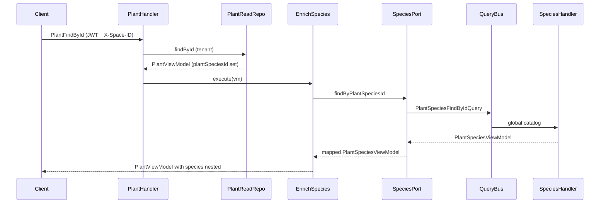

# Design: Plant Species Catalog + Plants Link

> **Global** name-only catalog (no tenancy). **REST + GraphQL**. Plants hold `plantSpeciesId`; reads enrich `species` via port (QR pattern).

---

## 1. Approach Summary

| Area | Decision |
|------|----------|
| Catalog scope | **Platform-global** — no `spaceId` on aggregate, entity, or API |
| Repos | Raw TypeORM `Repository` — **no** `createTenantRepository` |
| Uniqueness | Globally unique `name` (case-insensitive, trim); DB `UNIQUE (name)` on stored trimmed value |
| Catalog auth | `JwtAuthGuard` only — **no** `SpaceGuard`, no `X-Space-ID` |
| Transport | REST + GraphQL (queries + mutations) |
| Plants | `plantSpeciesId` persisted; nested `species` on `PlantViewModel` via `IPlantSpeciesPort` |
| Plants tenancy | Unchanged — `createTenantRepository` on plant repos |

### Gotchas

1. Register `PlantSpeciesInUseException` → 409 in `base-exception.filter.ts`.
2. `PlantSpeciesModule` must export `PlantSpeciesFindByIdQuery` handler path for adapter (or register query handlers globally via CqrsModule — same as QR).
3. Plants **must not** import `@contexts/plant-species` in domain/application.
4. Migration order: create `plant_species` before `ALTER plants ADD plant_species_id`.

---

## 2. File Tree

```
src/contexts/plant-species/
├── domain/ ... (aggregate, VOs, events, exceptions, repos)
├── application/ ... (commands, queries, assert services)
├── infrastructure/persistence/typeorm/ ...
├── transport/
│   ├── rest/ ... (controller, DTOs, mapper)
│   └── graphql/
│       ├── resolvers/plant-species-queries.resolver.ts
│       ├── resolvers/plant-species-mutations.resolver.ts
│       ├── dtos/requests/ ...
│       ├── dtos/responses/plant-species.response.dto.ts
│       ├── mappers/plant-species.mapper.ts
│       └── enums/plant-species-registered-enums.graphql.ts
└── plant-species.module.ts

src/contexts/plants/
├── application/ports/plant-species.port.ts          NEW
├── application/services/read/enrich-plant-with-species/  NEW
├── domain/view-models/plant-species.view-model.ts   NEW
├── domain/builders/plant-species.builder.ts           NEW
├── infrastructure/adapters/plant-species.adapter.ts NEW
├── domain/aggregates/plant.aggregate.ts               MODIFIED (plantSpeciesId, remove species)
├── ... commands, entity, DTOs, mappers, builder, view-model MODIFIED

src/database/migrations/
├── {ts}-CreatePlantSpecies.ts
└── {ts}-AlterPlantsPlantSpeciesId.ts
```

---

## 3. Domain Layer — `plant-species`

### 3.1 `PlantSpeciesAggregate`

**Fields:** `_id`, `_name`, timestamps. **No `_spaceId`.**

**Methods:** `create()`, `update({ name? })`, `delete()`, `toPrimitives()`.

### 3.2 Repository interfaces

```ts
export const PLANT_SPECIES_READ_REPOSITORY = Symbol('PLANT_SPECIES_READ_REPOSITORY');
export const PLANT_SPECIES_WRITE_REPOSITORY = Symbol('PLANT_SPECIES_WRITE_REPOSITORY');
```

Write repo: `findByNameNormalized(normalizedName: string): Promise<PlantSpeciesAggregate | null>`.

### 3.3 `PlantSpeciesTypeOrmEntity`

| Column | Type |
|--------|------|
| `id` | uuid PK |
| `name` | varchar(200) NOT NULL, **globally unique** |
| `createdAt` / `updatedAt` | timestamp |

`@Unique(['name'])` — application stores trimmed display name; assert uses `LOWER(TRIM(name))`.

### 3.4 Delete guard

```ts
export const PLANT_SPECIES_REFERENCE_PORT = Symbol('PLANT_SPECIES_REFERENCE_PORT');
export interface IPlantSpeciesReferencePort {
  countPlantsBySpeciesId(plantSpeciesId: string): Promise<number>;
}
```

Implemented in `plant-species/infrastructure/adapters/plant-species-reference.adapter.ts` using injected `PlantTypeOrmEntity` repository or QueryBus to a future `PlantCountBySpeciesIdQuery` in plants. **Preferred:** plants exposes `PlantCountBySpeciesIdQuery` + adapter in plant-species infrastructure calls QueryBus (keeps SQL out of plant-species if possible).

**Simpler v1:** `PlantSpeciesReferenceAdapter` in plant-species infra runs `COUNT(*)` on `plants` where `plant_species_id = :id` (cross-context read at infrastructure boundary only).

---

## 4. Application — `plant-species`

| Handler | Flow |
|---------|------|
| `CreatePlantSpecies` | assert name available → build → create → save → events |
| `UpdatePlantSpecies` | assert exists → assert name if changed → update → save |
| `DeletePlantSpecies` | assert exists → assert `countPlants === 0` → delete → events |

**No `SpaceContext` usage.**

---

## 5. Transport — `plant-species`

### 5.1 REST (`@Controller('plant-species')`)

| Method | Route | Guards |
|--------|-------|--------|
| POST | `/plant-species` | JwtAuthGuard |
| GET | `/plant-species` | JwtAuthGuard |
| GET | `/plant-species/:id` | JwtAuthGuard |
| PATCH | `/plant-species/:id` | JwtAuthGuard |
| DELETE | `/plant-species/:id` | JwtAuthGuard |

### 5.2 GraphQL

Mirror REST operations:

- Queries: `plantSpecies`, `plantSpeciesList` (paginated)
- Mutations: `createPlantSpecies`, `updatePlantSpecies`, `deletePlantSpecies`
- Use `CommandBus` / `QueryBus` in resolvers only
- Register enums/objects in `plant-species-registered-enums.graphql.ts`

---

## 6. Plants integration (QR mirror)

### 6.1 Port contract

```ts
// plants/application/ports/plant-species.port.ts
export interface IPlantSpeciesPort {
  findByPlantSpeciesId(plantSpeciesId: string): Promise<PlantSpeciesViewModel | null>;
}
```

### 6.2 `PlantSpeciesViewModel` (plants-owned read shape)

| Field | Type |
|-------|------|
| `id` | string |
| `name` | string |
| `createdAt` | Date |
| `updatedAt` | Date |

No `spaceId` — catalog is global.

### 6.3 `PlantSpeciesAdapter`

```ts
// plants/infrastructure/adapters/plant-species.adapter.ts
// QueryBus.execute(new PlantSpeciesFindByIdQuery({ plantSpeciesId }))
// Map to PlantSpeciesViewModel via PlantSpeciesBuilder
```

### 6.4 `EnrichPlantWithSpeciesService`

- If `!plant.plantSpeciesId` → return plant unchanged (`species: null`)
- Else `speciesPort.findByPlantSpeciesId(...)` → rebuild `PlantViewModel` with nested `species`

Wire into `PlantFindByIdHandler` and `PlantFindByCriteriaHandler` (same order as QR: after view-model load, before return).

### 6.5 Aggregate / persistence

**`PlantAggregate`:** replace `_species: PlantSpeciesValueObject | null` with `_plantSpeciesId: PlantSpeciesIdValueObject | null` (reuse catalog id VO type in plants as bare `UuidValueObject` wrapper `PlantSpeciesIdValueObject` in plants domain OR store as string — use `PlantSpeciesIdValueObject` imported from plants VO path `plant-species-id` under plants to avoid cross-context import: define `PlantLinkedSpeciesIdValueObject` in plants or plain UUID VO).

**Recommendation:** plants defines `PlantSpeciesIdValueObject extends UuidValueObject` locally (same pattern as storing `qrId` as string/VO) — validates UUID only, no catalog import.

**Entity:** `plant_species_id` uuid nullable; drop `species` column.

**Commands:** `CreatePlant` / `UpdatePlant` accept `plantSpeciesId?: string | null`. When set, `AssertPlantSpeciesExistsService` in plants (via port or query) validates catalog row exists.

### 6.6 `PlantViewModel`

```ts
public readonly plantSpeciesId: string | null;
public readonly species: PlantSpeciesViewModel | null; // enrichment only
// remove: public readonly species: string | null;
```

### 6.7 Module wiring

```ts
// plants.module.ts
{ provide: PLANT_SPECIES_PORT, useClass: PlantSpeciesAdapter },
EnrichPlantWithSpeciesService,
```

`PlantSpeciesModule` imported in `AppModule` (adapter needs QueryBus handlers registered).

---

## 7. Migrations

### 7.1 `CreatePlantSpecies`

```sql
CREATE TABLE "plant_species" (
  "id" uuid PRIMARY KEY DEFAULT uuid_generate_v4(),
  "name" varchar(200) NOT NULL,
  "created_at" TIMESTAMP NOT NULL DEFAULT now(),
  "updated_at" TIMESTAMP NOT NULL DEFAULT now(),
  CONSTRAINT "UQ_plant_species_name" UNIQUE ("name")
);
```

### 7.2 `AlterPlantsPlantSpeciesId`

```sql
ALTER TABLE "plants" ADD "plant_species_id" uuid NULL;
ALTER TABLE "plants" DROP COLUMN "species";
```

No DB FK constraint (project convention). Optional index on `plant_species_id` for delete guard counts.

---

## 8. Sequence — plant read with species



---

## 9. Architectural risks

| Risk | Mitigation |
|------|------------|
| Breaking plant API (`species` string → object) | CHANGELOG + client coordination |
| Global catalog spam | Future admin authz |
| Cross-context COUNT in delete | Port + integration test |
| Case-insensitive DB unique | App-layer normalized assert before save |
