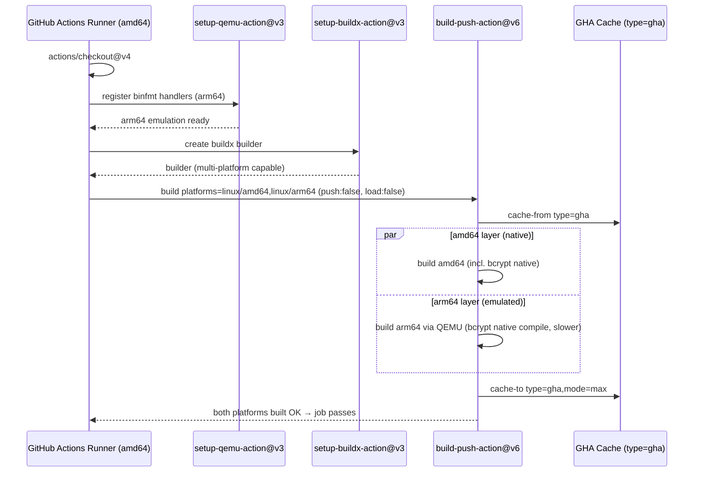

# Design: Docker Multi-Platform Smoke Build

## Context

The CI smoke build (`.github/workflows/docker.yml`) currently validates only `linux/amd64`, while the release pipeline (`.github/workflows/release.yml`) ships `linux/amd64,linux/arm64` through the reusable workflow `sisques-labs/workflows/.github/workflows/docker-release.yml@main`. This asymmetry means an architecture-specific build failure (e.g. `bcrypt`'s native addon failing to compile under the arm64 toolchain) passes the PR/main gate and only surfaces at release — the most expensive moment to discover it.

Current `docker.yml` job:

- Triggers: `pull_request` and `push` to `main`.
- Steps: `actions/checkout@v4` → `docker/setup-buildx-action@v3` → `docker/build-push-action@v6`.
- Build inputs: `platforms: linux/amd64`, `push: false`, `load: false`, `tags: gardenia-api:smoke`, `cache-from: type=gha`, `cache-to: type=gha,mode=max`.
- Concurrency: `group: docker-${{ github.workflow }}-${{ github.event.pull_request.number || github.sha }}`, `cancel-in-progress: true`.
- No `docker/setup-qemu-action` → no binfmt emulation available for arm64.

Constraints:

- Runners are `ubuntu-latest` (amd64 host); arm64 layers must be built via QEMU emulation.
- No `Dockerfile` changes are permitted/needed (multi-stage Node 22 build on multi-arch base images).
- Smoke build must remain validation-only (no push, no load).

## Goals / Non-Goals

**Goals:**

- Make the smoke build validate the **same** platform matrix the release ships (`linux/amd64,linux/arm64`).
- Surface arm64-only build failures on the PR, not at release time.
- Keep the build push-less and load-less (pure validation).
- Preserve GHA layer caching so steady-state CI time stays bounded.
- Maintain parity with `release.yml`'s `platforms` input.

**Non-Goals:**

- No `Dockerfile` modifications.
- No changes to `release.yml` or `ci.yml`.
- No registry push, image load, multi-arch manifest publishing, or attestations in CI.
- No replacement or optimization of `bcrypt` / native arm64 compilation.

## Decisions

### D1 — Add `docker/setup-qemu-action@v3` before buildx

buildx can only emulate a foreign architecture (arm64 on an amd64 host) if binfmt handlers are registered first. `docker/setup-qemu-action@v3` installs those handlers.

- **Step order (critical):** `checkout` → **`setup-qemu-action@v3`** → `setup-buildx-action@v3` → `build-push-action@v6`. QEMU MUST precede buildx; if buildx initializes before the binfmt handlers exist, the builder may be created without arm64 emulation support and the arm64 layer fails.
- **Rationale:** This is the standard, minimal mechanism for cross-platform builds on GitHub-hosted runners and mirrors how the reusable release workflow obtains arm64 support.
- **Alternative considered — native arm64 runners** (e.g. `ubuntu-24.04-arm` matrix): faster, no emulation, but requires a build matrix, doubles job count, and diverges from how `release.yml` produces its multi-arch manifest via a single emulated buildx build. Rejected to keep parity and simplicity; can be revisited if emulation time becomes blocking.

### D2 — Platform string `linux/amd64,linux/arm64`

Set `platforms: linux/amd64,linux/arm64` on `build-push-action@v6`, exactly matching the `platforms` input passed in `release.yml` (line 46).

- **Rationale:** String-identical parity makes the smoke build a true pre-flight of the release build. Any future platform change should be applied to both in lockstep.
- **Alternative considered — arm64 only on `push` to `main`** (PRs stay amd64-only): saves PR minutes but lets an arm64 break merge green and fail post-merge. Rejected as default (documented in proposal as the revisit path if PR CI time becomes a bottleneck).

### D3 — Keep `push: false` / `load: false`

Multi-platform buildx output cannot be loaded into the local Docker daemon (`load: true` only supports a single platform). The smoke build needs neither push nor load — a successful multi-platform build is itself the validation.

- **Rationale:** `load: true` would be incompatible with a two-platform build and would force an artificial single-platform or per-arch split. Leaving both `false` keeps the job as a pure "does it build on every target arch?" gate.

### D4 — Retain GHA cache (`type=gha`, `mode=max`)

Keep `cache-from: type=gha` and `cache-to: type=gha,mode=max` unchanged.

- **Rationale:** `mode=max` caches all intermediate layers; the GHA backend keys cache per platform, so once warmed each arch reuses its own layers on subsequent runs. The first multi-platform run pays the full uncached cost for the new arm64 platform (one-time).
- **Note:** No `scope` differentiation is required — the single build invocation covers both platforms and the action manages per-platform cache keys internally.

### D5 — Concurrency unchanged

Keep the existing `concurrency` group and `cancel-in-progress: true`.

- **Rationale:** Behavior is correct and unaffected by adding a platform. Superseded in-flight runs (new push to the same PR/branch) should still cancel to save the now-longer emulated runs — this becomes *more* valuable as run time grows.

## File Change Plan

| File | Action | Change |
|------|--------|--------|
| `.github/workflows/docker.yml` | Modify | Insert a `Set up QEMU` step using `docker/setup-qemu-action@v3` between `checkout` and `Set up Docker Buildx`; change `platforms: linux/amd64` → `platforms: linux/amd64,linux/arm64`. No other keys change. |
| `.github/workflows/release.yml` | None | Reference only — already `platforms: linux/amd64,linux/arm64`. Parity target. |
| `Dockerfile` | None | Multi-arch base images; builds under arm64 emulation without change. |

Target end-state step sequence for `docker.yml`:

```
1. actions/checkout@v4
2. docker/setup-qemu-action@v3      # NEW — must precede buildx
3. docker/setup-buildx-action@v3
4. docker/build-push-action@v6      # platforms: linux/amd64,linux/arm64; push:false load:false
```

## Build Flow (sequence)



## Failure Modes

| Failure | Cause | Behavior / Detection |
|---------|-------|----------------------|
| arm64 layer build error | Native dep (e.g. `bcrypt`) fails to compile under emulation | Job fails on the affected platform — **this is the intended new signal** the change adds |
| arm64 emulation unavailable | QEMU step missing or placed after buildx | buildx builder lacks arm64 binfmt; arm64 build fails with exec-format / unsupported-platform error → enforce step order (D1) |
| `load: true` set with two platforms | Misconfiguration | build-push-action errors: multi-platform output not loadable → keep `load: false` (D3) |
| First-run timeout / very slow run | Cold GHA cache + emulated arm64 + bcrypt compile | One-time cost; subsequent runs warm (D4); revisit arm64-on-main-only if persistently blocking |

## Parity with `release.yml`

| Aspect | `docker.yml` (smoke, after change) | `release.yml` (release) |
|--------|------------------------------------|-------------------------|
| Platforms | `linux/amd64,linux/arm64` | `linux/amd64,linux/arm64` (input, line 46) |
| arm64 mechanism | QEMU emulation on amd64 runner | Emulation via reusable `docker-release.yml` |
| Push | `false` (validation only) | `true` (Docker Hub + GHCR) |
| Trigger | `pull_request`, `push: main` | `workflow_dispatch` |
| Node version | from `Dockerfile` (Node 22) | `node_version: "22"` |

The smoke build is a faithful pre-flight of the release build's platform matrix; the only intentional divergences are push/trigger (validation vs. publish). When the release platform set changes, `docker.yml` must be updated in lockstep.

## Risks / Trade-offs

- **[CI time +5–15 min per run on PRs and main]** → Accepted trade-off; `type=gha mode=max` warms after the first run. Documented fallback: build arm64 only on `push` to `main`.
- **[First multi-platform run pays full uncached arm64 cost]** → One-time; cache reuse on subsequent runs.
- **[QEMU step omitted or mis-ordered → arm64 fails]** → Spec/tasks MUST place `setup-qemu-action@v3` before `setup-buildx-action@v3`.
- **[Future native dependency breaks under arm64]** → This change is precisely the mechanism that surfaces such failures in CI rather than at release.

## Migration / Rollback

- **Deploy:** Single-file edit to `docker.yml`; effective on next `pull_request` / `push` to `main`. No app code, migrations, or shared state.
- **Rollback:** Revert `platforms` to `linux/amd64` and remove the QEMU step. Self-contained; `release.yml` unaffected throughout.

## Open Questions

- None blocking. If PR CI time becomes a sustained bottleneck, evaluate the documented "arm64 on `main` only" fallback or native arm64 runners (D1 alternative).
